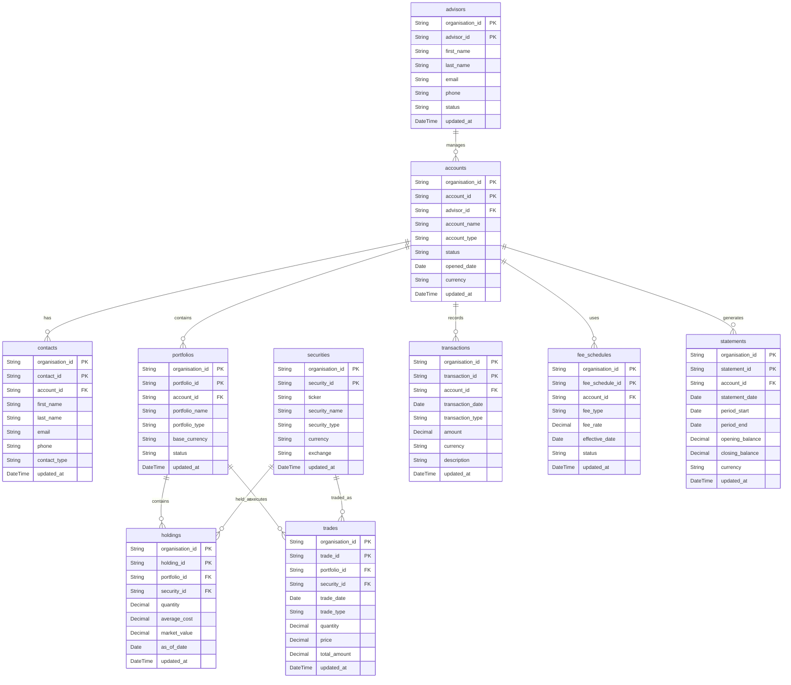

# Wealth Management Data Platform — Schema Design

## 1. Overview

This project uses a **Medallion Architecture** to process wealth-management data through three layers:

### Bronze

The Bronze layer stores raw source data with minimal transformation.

- Format: ORC
- Storage: MinIO
- Data is organized by source, organisation and processing date.
- Storage path:

```text
bronze/<source>/<table>/organisation_id=<org>/processing_date=<date>/data.orc
```

Bronze preserves source data as closely as possible for traceability and reprocessing.

### Silver

The Silver layer contains cleaned, validated, deduplicated and normalized data.

- Enforces tenant-aware business identity using `(organisation_id, <table>_id)`.
- Daily Silver grain is `(organisation_id, <table>_id, processing_date)`.
- When multiple records for the same business key occur within a processing day, the record with the latest `updated_at` is retained.
- Foreign-key relationships are logically enforced using the complete `(organisation_id, id)` key.
- Historical/current-record tracking can be built on top of the daily Silver data using `valid_from`, `valid_to` and `is_current`.

### Gold

The Gold layer contains business-ready datasets derived from Silver.

Examples include:

- Portfolio valuations
- Advisor-level AUM
- Security exposure
- Trading activity
- Fee analysis
- Client/account reporting

Gold tables are designed for analytics and reporting rather than operational normalization.

---

## 2. Data Processing Setup

### Organisations

The seeded dataset contains three organisations:

```text
org_8812
org_4421
org_7305
```

### Processing Dates

Data is generated for seven processing dates:

```text
2026-08-19
2026-08-20
2026-08-21
2026-08-22
2026-08-23
2026-08-24
2026-08-25
```

### Bronze Storage Pattern

```text
bronze/<source>/<table>/organisation_id=<org>/processing_date=<date>/data.orc
```

Example:

```text
bronze/crm/accounts/organisation_id=org_8812/processing_date=2026-08-25/data.orc
```

### Source Mapping

| Source | Tables |
|---|---|
| `crm` | `advisors`, `accounts`, `contacts` |
| `custodian` | `portfolios`, `holdings`, `trades`, `transactions`, `statements` |
| `market_data` | `securities` |
| `billing` | `fee_schedules` |

---

# 3. Schema Definitions

All tables follow these common rules:

- `organisation_id` is the multi-tenancy boundary.
- Logical business identity is `(organisation_id, <table>_id)`.
- Silver daily grain additionally includes `processing_date`.
- `updated_at` is used to select the latest version within a processing day.
- Foreign keys are tenant-aware and include `organisation_id`.
- `processing_date` is an ingestion/partition attribute rather than part of the logical business identity.

---

## 3.1 `advisors`

Stores financial advisors responsible for managing client accounts.

**Source:** `crm`

| Column | Type | Description |
|---|---|---|
| `organisation_id` | String | Organisation that owns the advisor record. |
| `advisor_id` | String | Advisor identifier within an organisation. |
| `first_name` | String | Advisor's first name. |
| `last_name` | String | Advisor's last name. |
| `email` | String | Advisor's email address. |
| `phone` | String | Advisor's contact phone number. |
| `status` | String | Advisor status, such as Active or Inactive. |
| `updated_at` | DateTime | Last source update timestamp used for deduplication. |

**Business key:**

```text
(organisation_id, advisor_id)
```

**Foreign keys:** None.

---

## 3.2 `accounts`

Stores investment accounts managed by advisors.

**Source:** `crm`

| Column | Type | Description |
|---|---|---|
| `organisation_id` | String | Organisation that owns the account. |
| `account_id` | String | Account identifier within an organisation. |
| `advisor_id` | String | Advisor responsible for the account. |
| `account_name` | String | Display name of the investment account. |
| `account_type` | String | Account type, such as Brokerage, IRA or Trust. |
| `status` | String | Current account status. |
| `opened_date` | Date | Date the account was opened. |
| `currency` | String | Account's base currency. |
| `updated_at` | DateTime | Last source update timestamp used for deduplication. |

**Business key:**

```text
(organisation_id, account_id)
```

**Foreign keys:**

```text
(organisation_id, advisor_id)
    -> advisors(organisation_id, advisor_id)
```

---

## 3.3 `contacts`

Stores clients and other contacts associated with investment accounts.

**Source:** `crm`

| Column | Type | Description |
|---|---|---|
| `organisation_id` | String | Organisation that owns the contact. |
| `contact_id` | String | Contact identifier within an organisation. |
| `account_id` | String | Account associated with the contact. |
| `first_name` | String | Contact's first name. |
| `last_name` | String | Contact's last name. |
| `email` | String | Contact's email address. |
| `phone` | String | Contact's phone number. |
| `contact_type` | String | Contact role, such as Primary Client or Beneficiary. |
| `updated_at` | DateTime | Last source update timestamp used for deduplication. |

**Business key:**

```text
(organisation_id, contact_id)
```

**Foreign keys:**

```text
(organisation_id, account_id)
    -> accounts(organisation_id, account_id)
```

---

## 3.4 `securities`

Stores financial instruments that can be held or traded.

**Source:** `market_data`

| Column | Type | Description |
|---|---|---|
| `organisation_id` | String | Organisation that owns the security record. |
| `security_id` | String | Security identifier within an organisation. |
| `ticker` | String | Security ticker symbol. |
| `security_name` | String | Full security name. |
| `security_type` | String | Type of security, such as Stock, Bond or ETF. |
| `currency` | String | Security's trading currency. |
| `exchange` | String | Primary exchange or trading venue. |
| `updated_at` | DateTime | Last source update timestamp used for deduplication. |

**Business key:**

```text
(organisation_id, security_id)
```

**Foreign keys:** None.

---

## 3.5 `portfolios`

Stores investment portfolios associated with client accounts.

**Source:** `custodian`

| Column | Type | Description |
|---|---|---|
| `organisation_id` | String | Organisation that owns the portfolio. |
| `portfolio_id` | String | Portfolio identifier within an organisation. |
| `account_id` | String | Account associated with the portfolio. |
| `portfolio_name` | String | Portfolio display name. |
| `portfolio_type` | String | Portfolio classification or investment strategy. |
| `base_currency` | String | Portfolio's base currency. |
| `status` | String | Current portfolio status. |
| `updated_at` | DateTime | Last source update timestamp used for deduplication. |

**Business key:**

```text
(organisation_id, portfolio_id)
```

**Foreign keys:**

```text
(organisation_id, account_id)
    -> accounts(organisation_id, account_id)
```

> The portfolio does not contain `advisor_id` because its advisor can be obtained through its account. This avoids storing the same relationship redundantly and keeps the model normalized.

---

## 3.6 `holdings`

Stores securities currently held within portfolios.

**Source:** `custodian`

| Column | Type | Description |
|---|---|---|
| `organisation_id` | String | Organisation that owns the holding. |
| `holding_id` | String | Holding identifier within an organisation. |
| `portfolio_id` | String | Portfolio containing the holding. |
| `security_id` | String | Security being held. |
| `quantity` | Decimal(18,2) | Number of units held. |
| `average_cost` | Decimal(18,2) | Average acquisition cost per unit. |
| `market_value` | Decimal(18,2) | Market value supplied by the source. |
| `as_of_date` | Date | Date on which the holding position was measured. |
| `updated_at` | DateTime | Last source update timestamp used for deduplication. |

**Business key:**

```text
(organisation_id, holding_id)
```

**Foreign keys:**

```text
(organisation_id, portfolio_id)
    -> portfolios(organisation_id, portfolio_id)

(organisation_id, security_id)
    -> securities(organisation_id, security_id)
```

**Note:** `market_value` is a derived financial measure in principle, but it is retained because it may be supplied by the custodian as an authoritative source value.

---

## 3.7 `trades`

Stores executed buy and sell trades for securities.

**Source:** `custodian`

| Column | Type | Description |
|---|---|---|
| `organisation_id` | String | Organisation that owns the trade. |
| `trade_id` | String | Trade identifier within an organisation. |
| `portfolio_id` | String | Portfolio in which the trade occurred. |
| `security_id` | String | Security that was traded. |
| `trade_date` | Date | Date the trade was executed. |
| `trade_type` | String | Trade direction, such as Buy or Sell. |
| `quantity` | Decimal(18,2) | Number of units traded. |
| `price` | Decimal(18,2) | Execution price per unit. |
| `total_amount` | Decimal(18,2) | Total trade value supplied by the source. |
| `updated_at` | DateTime | Last source update timestamp used for deduplication. |

**Business key:**

```text
(organisation_id, trade_id)
```

**Foreign keys:**

```text
(organisation_id, portfolio_id)
    -> portfolios(organisation_id, portfolio_id)

(organisation_id, security_id)
    -> securities(organisation_id, security_id)
```

**Note:** `total_amount` can be calculated as `quantity × price`, but it is retained because vendors may provide it as a source value.

---

## 3.8 `transactions`

Stores financial transactions associated with investment accounts.

**Source:** `custodian`

| Column | Type | Description |
|---|---|---|
| `organisation_id` | String | Organisation that owns the transaction. |
| `transaction_id` | String | Transaction identifier within an organisation. |
| `account_id` | String | Account associated with the transaction. |
| `transaction_date` | Date | Date the transaction occurred. |
| `transaction_type` | String | Transaction type, such as Deposit, Withdrawal, Dividend or Fee. |
| `amount` | Decimal(18,2) | Transaction amount. |
| `currency` | String | Transaction currency. |
| `description` | String | Human-readable transaction description. |
| `updated_at` | DateTime | Last source update timestamp used for deduplication. |

**Business key:**

```text
(organisation_id, transaction_id)
```

**Foreign keys:**

```text
(organisation_id, account_id)
    -> accounts(organisation_id, account_id)
```

> The advisor is intentionally not stored here. The advisor for a transaction can be obtained through `accounts.advisor_id`.

---

## 3.9 `fee_schedules`

Stores fee structures applicable to investment accounts.

**Source:** `billing`

| Column | Type | Description |
|---|---|---|
| `organisation_id` | String | Organisation that owns the fee schedule. |
| `fee_schedule_id` | String | Fee schedule identifier within an organisation. |
| `account_id` | String | Account to which the fee schedule applies. |
| `fee_type` | String | Fee type, such as Management or Performance. |
| `fee_rate` | Decimal(9,4) | Fee rate, stored with four decimal places for percentage precision. |
| `effective_date` | Date | Date from which the fee schedule applies. |
| `status` | String | Current status of the fee schedule. |
| `updated_at` | DateTime | Last source update timestamp used for deduplication. |

**Business key:**

```text
(organisation_id, fee_schedule_id)
```

**Foreign keys:**

```text
(organisation_id, account_id)
    -> accounts(organisation_id, account_id)
```

> The fee schedule does not store `advisor_id` because the advisor relationship is available through the associated account.

---

## 3.10 `statements`

Stores periodic account statements.

**Source:** `custodian`

| Column | Type | Description |
|---|---|---|
| `organisation_id` | String | Organisation that owns the statement. |
| `statement_id` | String | Statement identifier within an organisation. |
| `account_id` | String | Account covered by the statement. |
| `statement_date` | Date | Date represented by the statement. |
| `period_start` | Date | Beginning of the statement period. |
| `period_end` | Date | End of the statement period. |
| `opening_balance` | Decimal(18,2) | Account balance at the beginning of the period. |
| `closing_balance` | Decimal(18,2) | Account balance at the end of the period. |
| `currency` | String | Statement currency. |
| `updated_at` | DateTime | Last source update timestamp used for deduplication. |

**Business key:**

```text
(organisation_id, statement_id)
```

**Foreign keys:**

```text
(organisation_id, account_id)
    -> accounts(organisation_id, account_id)
```

> The statement does not store `advisor_id` because the advisor can be obtained through the associated account.

---

# 4. Entity Relationship Diagram

The schema follows a normalized relational model. Foreign keys are logically tenant-aware by including `organisation_id`.



---

# 5. Partition Columns and Silver Grain

The Bronze data is physically partitioned in MinIO using:

| Partition Column | Type | Purpose |
|---|---|---|
| `organisation_id` | String | Separates data by tenant and provides the multi-tenancy boundary. |
| `processing_date` | Date | Identifies the ingestion/processing batch and supports incremental processing. |

The physical storage layout is:

```text
bronze/<source>/<table>/
    organisation_id=<org>/
        processing_date=<date>/
            data.orc
```

Example:

```text
bronze/crm/accounts/
    organisation_id=org_8812/
        processing_date=2026-08-25/
            data.orc
```

### Logical identity vs. Silver grain

The logical business key remains:

```text
(organisation_id, <table>_id)
```

However, the **daily Silver table grain** is:

```text
(organisation_id, <table>_id, processing_date)
```

This means the same business entity can appear in multiple daily Silver partitions as its source data changes over time.

Within a single processing day, if multiple records exist for the same business key, the record with the latest `updated_at` is retained.

A separate current-state view or table can then select the latest record **across processing dates**. Historical/current tracking can use:

```text
valid_from
valid_to
is_current
```

These history-management columns are added during Silver processing rather than being part of the raw Bronze schema.

Therefore:

```text
Logical business key:
(organisation_id, account_id)

Daily Silver grain:
(organisation_id, account_id, processing_date)
```

`processing_date` is **not** part of the logical business identity.

---

# 6. Seeded Collision

The test dataset deliberately contains the same `account_id` in two different organisations:

```text
account_id = ACC-1001
```

The records belong to:

```text
org_8812
org_4421
```

Example:

| organisation_id | account_id | account_name | advisor_id |
|---|---|---|---|
| `org_8812` | `ACC-1001` | Northstar Growth Account | `ADV-001` |
| `org_4421` | `ACC-1001` | Meridian Wealth Account | `ADV-017` |

Although the `account_id` is identical, these are **two separate business records** because `organisation_id` is part of the business key.

The correct uniqueness rule is:

```text
(organisation_id, account_id)
```

Therefore both of these are valid:

```text
(org_8812, ACC-1001)
(org_4421, ACC-1001)
```

A deduplication strategy using only:

```text
account_id
```

would incorrectly treat the two records as duplicates.

The Silver pipeline must therefore deduplicate using the tenant-aware key:

```text
organisation_id + account_id
```

with `updated_at` determining the latest version within each processing day.

This collision is an explicit validation case for **multi-tenancy isolation**.

---

# 7. Normalization and Data Integrity Principles

### 7.1 Tenant-aware identity

Every entity is uniquely identified within an organisation using:

```text
(organisation_id, <table>_id)
```

IDs are therefore not assumed to be globally unique.

### 7.2 3NF normalization

The Silver model avoids storing attributes that can be obtained transitively through another entity.

For example:

```text
transactions
    -> account
        -> advisor
```

Therefore `transactions` stores `account_id`, but does not duplicate `advisor_id`.

The same principle applies to:

- `fee_schedules`
- `statements`
- `portfolios`

A portfolio obtains its advisor through its account.

This prevents conflicting values such as:

```text
portfolio.advisor_id = ADV-001
account.advisor_id   = ADV-002
```

for the same account relationship.

### 7.3 Tenant-aware relationships

Foreign keys include `organisation_id`:

```text
(organisation_id, account_id)
    -> accounts(organisation_id, account_id)
```

This prevents an entity from logically referencing an entity belonging to another organisation.

### 7.4 ClickHouse foreign keys

ClickHouse does not enforce traditional relational foreign-key constraints in the same way as a transactional OLTP database.

The relationships documented here are therefore **logical foreign keys**.

Referential integrity should be validated by the data pipeline, for example by checking for orphan records before or during Silver/Gold processing.

Examples:

```text
holdings -> portfolios
holdings -> securities
trades -> portfolios
trades -> securities
transactions -> accounts
```

### 7.5 Derived values

Some financial measures may be mathematically derivable from other columns.

For example:

```text
trade total_amount = quantity × price
```

and:

```text
holding market_value ≈ quantity × market price
```

These columns are retained because they may be supplied directly by upstream vendors and can represent authoritative source values.

---

# 8. Summary

The platform contains exactly **10 core entities**:

```text
advisors
accounts
contacts
securities
portfolios
holdings
trades
transactions
fee_schedules
statements
```

The core relationship structure is:

```text
advisors
    |
    v
accounts
    |
    +----> contacts
    |
    +----> portfolios ----> holdings ----> securities
    |           |
    |           +---------> trades ------> securities
    |
    +----> transactions
    |
    +----> fee_schedules
    |
    +----> statements
```

Every entity maintains tenant isolation through:

```text
(organisation_id, <table>_id)
```

The daily Silver grain is:

```text
(organisation_id, <table>_id, processing_date)
```

and `updated_at` determines the latest version within a processing day.

This design provides a normalized Silver foundation for building analytics-ready Gold models while preserving tenant isolation, incremental processing and historical change tracking.
